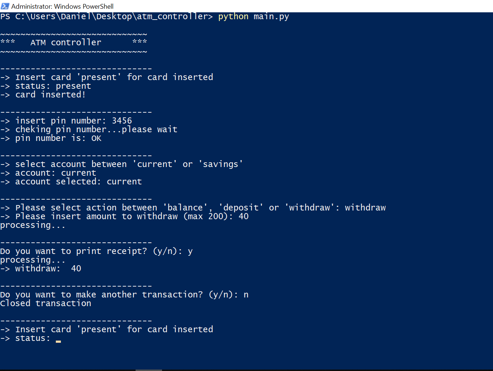

# Implement a simple ATM controller
Insert Card => PIN number => Select Account => See Balance/Deposit/Withdraw<br>
This is a simple implementation of an atm controller using a command line user interface.

## Example
<br>

## Test in local
```
python3.7 main.py
```

## Test in atm
This is a test with a listener and publisher node: <br>
- Listener: read a string for testing the controller in the atm
- Publisher: send the string to test the controller in the atm

In *atm_controller/include*:
1. In one terminal run:
```
python3.7 real_atm_listener.py
```
2. In another one run
```
python3.7 sample.py y
```
3. In the first terminal follow the steps.

## Step-by-step
1. read if card is inserted
2. read pin number
3. select account
4. see balance/deposit/withdraw